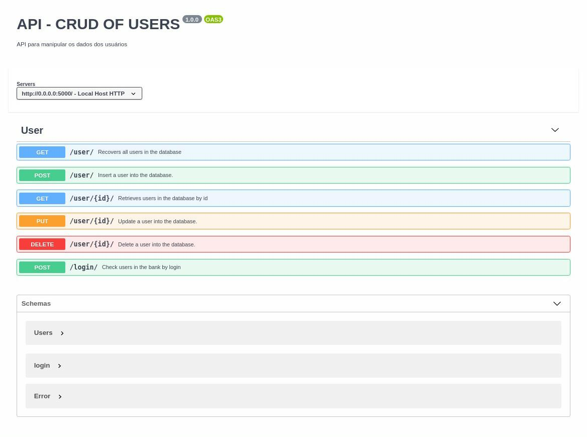

# API OF CRUD FLASK

### Api responsavel por gerenciar o crud de usuários, e obter seus dados.
 

Principais características:

* Criptografia de senha
* Persistencia de dados
* Cadastra, Atualiza, remove e busca usuários.

Dependencias:

*   MongoDB 

*   Docker 

## Configure seu container docker com o mongo:
    sudo docker pull mongo:4.0.4
    sudo docker run -d -p 27017-27019:27017-27019 --name mongodb mongo:4.0.4

## PASSOS PARA EXECULTAR:

    git clone 

    cd API-FLASK

    pip3 install -r requirements.txt

    python3 server.py

# Acesso a documentação 
    http://0.0.0.0:5000/v1/reference

# Documentação:

## Feito com muito esforço, por Simeone Holanda!

   

   

    

